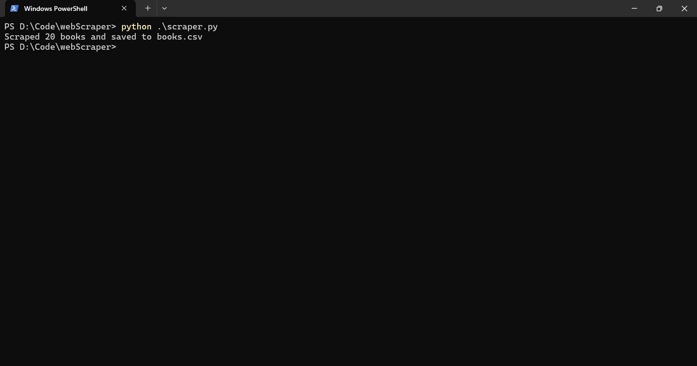
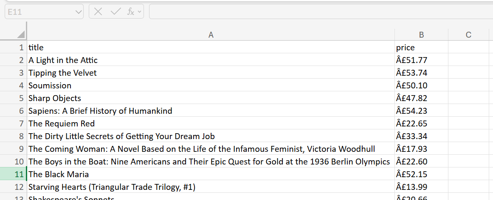

# Python Web Scraper
A Python script to scrape book titles and prices from books.toscrape.com.
## Features
- Extracts book titles and prices
- Saves data to a CSV file
- Basic error handling
## Screenshots

## How to Run
1. Install dependencies: `pip install requests beautifulsoup4`
2. Run `python scraper.py`